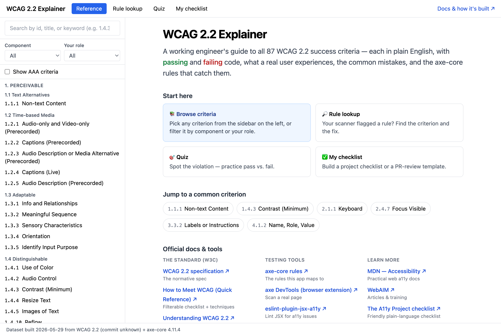
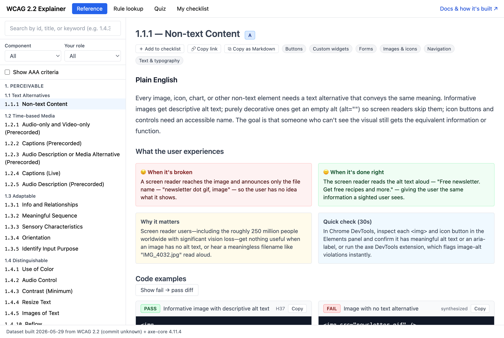

# wcag-explainer

A Claude Code skill that scaffolds a local WCAG 2.2 criterion-explainer React app.

[](https://github.com/patriciagoh/wcag-explainer/actions/workflows/ci.yml)
[](https://patriciagoh.github.io/wcag-explainer/)
[](https://patriciagoh.github.io/wcag-explainer/docs/features.html)
[](https://patriciagoh.github.io/wcag-explainer/docs/build-pipeline.html)
[](LICENSE)

🚀 **Live app:** <https://patriciagoh.github.io/wcag-explainer/>
📖 **Docs:** [App features](https://patriciagoh.github.io/wcag-explainer/docs/features.html) · [How the dataset is built](https://patriciagoh.github.io/wcag-explainer/docs/build-pipeline.html)

[](https://patriciagoh.github.io/wcag-explainer/)

Per-criterion: plain English, what the user experiences, pass/fail code (with a fail→pass diff), common mistakes, and the axe-core rules that catch it.

[](https://patriciagoh.github.io/wcag-explainer/#1.1.1)

## For end users (engineers being onboarded)

**Just want to look something up?** Use the hosted app — no setup:
**<https://patriciagoh.github.io/wcag-explainer/>**

**Want your own copy** (offline, editable, ownable by your team)? In any Claude Code session, ask Claude to use the `wcag-explainer` skill. It scaffolds a React app into `./wcag-explainer/`, installs deps, and starts a local dev server. Open the URL it prints.

## For skill authors (you, rebuilding the dataset)

The dataset shipped at `template/src/data/wcag-criteria.json` is built from three sources:

- W3C WCAG 2.2 structured data (`github.com/w3c/wcag`)
- Scraped W3C technique pages (linked from each criterion)
- axe-core rule metadata

There's a three-phase pipeline in `scripts/`:

### Phase 1: fetch (automated)

```bash
cd scripts
npm install
npm run build:dataset -- --fetch
```

Writes `scripts/raw/criteria-raw.json`. Deterministic; commit it.

### Phase 2: enrich (scripted)

```bash
cd scripts
ANTHROPIC_API_KEY=sk-... npm run enrich
```

Calls the Claude API per criterion and writes `scripts/cache/{id}.json`. Incremental: cached per input hash, so re-runs only re-enrich criteria with changed inputs. Scope to one principle with `--only=1` (…`4`), re-enrich everything with `--force`, or recompute hashes without the API via `--reconcile`. No API key? See `scripts/enrich-with-claude.md` for the manual fallback.

### Phase 3: merge (automated)

```bash
cd scripts
npm run build:dataset -- --merge
```

Writes `template/src/data/wcag-criteria.json`. Validates against zod schema; fails loudly on missing fields.

### Checking for upstream updates

```bash
cd scripts
npm run check-updates
```

Diffs upstream WCAG + axe-core against the shipped dataset. Exits non-zero if anything changed. The `.github/workflows/check-updates.yml` runs this weekly and opens a PR.

### Updating after upstream changes

```bash
cd scripts
npm run build:dataset -- --fetch         # re-fetch
ANTHROPIC_API_KEY=sk-... npm run enrich  # re-enrich changed criteria
npm run build:dataset -- --merge         # re-merge
```

The enrichment cache skips unchanged criteria automatically.

## Files

- `SKILL.md` — what Claude does on user invocation
- `template/` — the Vite + React + TS + Tailwind app, copied per invocation
- `scripts/` — dataset build pipeline
- `docs/` — visual docs (published via GitHub Pages): `features.html`, `build-pipeline.html`
- `.github/workflows/check-updates.yml` — weekly upstream drift PR
- `.github/workflows/deploy-pages.yml` — builds the app + docs and deploys to GitHub Pages

## Contributing

Contributions welcome — see [CONTRIBUTING.md](CONTRIBUTING.md) and
[ARCHITECTURE.md](ARCHITECTURE.md). This project follows the
[Contributor Covenant](CODE_OF_CONDUCT.md).

## License

[MIT](LICENSE) © 2026 Patricia Goh
